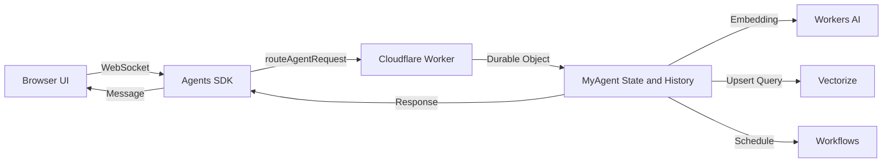

# Cloudflare AI Edge Memory Chat

An AI-powered chat app built entirely on Cloudflare using:

- 🧠 Llama on Workers AI
- 💬 Agents SDK for coordination and real-time chat  
- 🪶 Vectorize for long-term memory  
- 🔁 Workflow / coordination ( using Workflows, Workers or Durable Objects) 
- ⚡ Durable Objects for state management  


### Demo Screenshot
<!-- Replace the path below with your actual screenshot file -->
)


### Run locally
```bash
npm install
npm run dev
```

### Dev setup
1. Install dependencies:
```bash
npm install
npm install --prefix client
```
2. Login to Cloudflare (one-time on your machine):
```bash
npx wrangler login
```
3. Start Worker API (Terminal A):
```bash
npm run dev
```
4. Start frontend (Terminal B):
```bash
npm run client
```
5. Open `http://localhost:5173`.

Notes:
- In local mode, `MEMORY_INDEX` may show a Vectorize warning. Chat still works with the current fallback path.
- If you want remote Vectorize in dev, create an index first, then set `remote = true` under `[[vectorize]]` in `wrangler.toml`.

### How it works (request flow)

